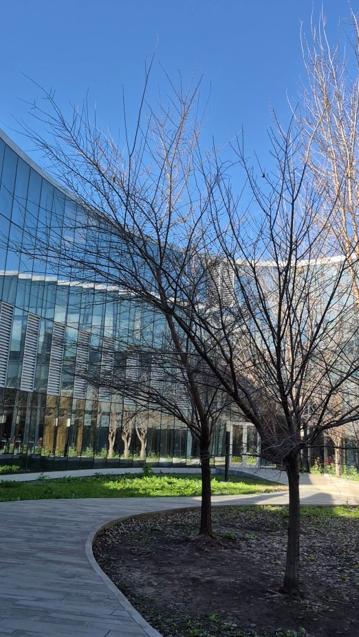

--- 
title: "Presenting My Article at 54JAIIO" 
publishDate: "2025-08-04" 
description: "Presenting my research article at the 54th Argentine Conference on Informatics and Operations Research (JAIIO)." 
tags: 
  - academic 
  - conference 
  - research 
  - experience 
heroImage: { src: './conference-diploma.png', color: '#872b6a' } 
language: 'English' 
---

## 📄 Presenting My Article 

On August 4th, 2025, I had the honor of **presenting my article** at the **[54th JAIIO (Argentine Conference on Informatics and Operations Research)](https://54jaiio.sadio.org.ar/)**, within the **ASSE (Argentine Symposium on Software Engineering)**.  

The event was held at the **[Pabellón Cero + Infinito](https://maps.app.goo.gl/FyJ6i9yjnTR6QaKq9)** of the Faculty of Exact and Natural Sciences at the University of Buenos Aires — a modern space that perfectly matched the spirit of innovation and collaboration.

---

My article is distilled from my [thesis work](/blog/academia). Condensing ideas into a concise conference paper was challenging, but also rewarding.  

Presenting it at ASSE was a milestone for me: it allowed me to share my findings with the software engineering community.

The audience posed thoughtful questions, ranging from practical implementation concerns to potential new directions.

<iframe width="1296" height="729" src="https://www.youtube.com/embed/ss8t2WDd4Ao" title="54JAIIO 2025-08-04" frameborder="0" allow="accelerometer; autoplay; clipboard-write; encrypted-media; gyroscope; picture-in-picture; web-share" referrerpolicy="strict-origin-when-cross-origin" allowfullscreen></iframe>

---

## 🌍 A Space for Growth  
Since 1961, JAIIO—organized by the **[Argentine Society of Informatics (SADIO)](https://sadio.org.ar/)**—has been a landmark event for the computing community in Argentina. Being part of this conference reaffirmed the importance of **sharing knowledge through publication and dialogue**. It’s not only about presenting results but also about building bridges with others who are working on related challenges.  

---

## 🙏 Acknowledgments  
I am grateful to the organizers of JAIIO and ASSE for creating this space, and to the community of researchers and professionals who attended and engaged with my work.
